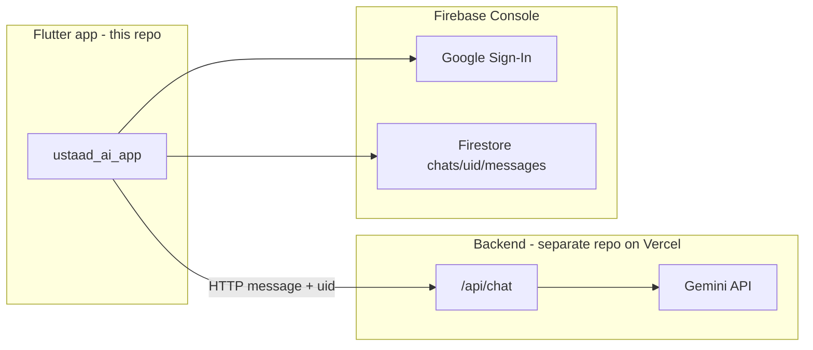

# Ustaad AI — Mobile App

Flutter Android app for **Ustaad AI**. It uses **Google Sign-In** (Firebase Auth), stores chat in **Firestore**, and calls the **Next.js backend** on Vercel for AI replies.

| Service | URL / project |
|--------|----------------|
| **Backend (production)** | https://karigar-ai-nu.vercel.app |
| **Firebase project** | `khidmatai-9f41f` |
| **Android package name** | `com.example.ustaad_ai_app` |

---

## Architecture



| Piece | Where it lives | What it does |
|--------|----------------|--------------|
| **Mobile app** | **This GitHub repo** | UI, sign-in, Firestore, calls backend |
| **Backend** | **Separate repo** → Vercel | `/api/chat` → Gemini |
| **Firebase** | Firebase Console (not in Git) | Auth + database + SHA keys for Google Sign-In |

Pushing to this repo does **not** deploy the backend. Only the **Vercel-connected backend repo** deploys when that repo’s `main` branch is updated.

---

## Repository layout (what to edit)

| Path | Purpose |
|------|---------|
| `lib/main.dart` | Chat UI, API calls, drawer |
| `lib/auth_screen.dart` | Login screen |
| `lib/config.dart` | Backend base URL |
| `lib/services/google_auth_service.dart` | Google Sign-In |
| `lib/services/chat_repository.dart` | Firestore `chats/{uid}/messages` |
| `lib/firebase_options.dart` | Firebase client config (generated) |
| `android/app/google-services.json` | Firebase Android config — get from team lead or Firebase Console |
| `android/app/build.gradle.kts` | Android SDK, package name, signing |
| `firestore.rules` | Security rules — publish in Firebase Console |
| `README_FOR_BUILDER.md` | Short APK build steps |

---

## New teammate setup

### 1. Install tools

- [Flutter SDK](https://docs.flutter.dev/get-started/install)
- [Android Studio](https://developer.android.com/studio) (SDK, Build-Tools, NDK)
- [Git](https://git-scm.com/downloads)

Run:

```bash
flutter doctor
```

Fix anything marked with ✗ before building.

### 2. Clone this repo

**HTTPS:**

```bash
git clone https://github.com/YOUR_ORG/ustaad_ai_app.git
cd ustaad_ai_app
flutter pub get
```

**SSH** (after adding your SSH key to GitHub — see below):

```bash
git clone git@github.com:YOUR_ORG/ustaad_ai_app.git
cd ustaad_ai_app
flutter pub get
```

### 3. Secrets (ask project lead — not on public GitHub)

For **debug** on emulator/device you may only need `google-services.json`.

For **release APK** you also need:

- `android/app/google-services.json`
- `android/key.properties`
- `android/ustaad-ai-key.jks`

Share these via a **password manager** or encrypted zip — not in public chat.

### 4. Run the app

```bash
flutter run
```

### 5. Low disk space on Windows (optional)

```powershell
$env:GRADLE_USER_HOME = "M:\gradle_cache"
flutter build apk --release
```

---

## GitHub: let teammates edit this project

### Step A — Create or use a GitHub repository

1. Go to [github.com](https://github.com) and sign in.
2. **New repository** (or use existing).
3. Name example: `ustaad_ai_app`.
4. Choose **Private** (recommended — Firebase config is sensitive).
5. Do **not** initialize with README if you already have local code.

Push your local project (first time only):

```bash
cd path\to\ustaad_ai_app
git init
git add .
git commit -m "Initial commit: Ustaad AI Flutter app"
git branch -M main
git remote add origin https://github.com/YOUR_USERNAME/ustaad_ai_app.git
git push -u origin main
```

Replace `YOUR_USERNAME` and repo name with yours.

### Step B — Invite collaborators (so others can push changes)

1. Open the repo on GitHub.
2. **Settings** → **Collaborators** (or **Manage access** for organizations).
3. Click **Add people**.
4. Enter teammate’s GitHub username or email.
5. Choose role:
   - **Write** — can clone, push branches, open PRs (typical for developers).
   - **Maintain** — can manage some settings.
   - **Admin** — full control (usually project lead only).

They accept the email invite, then can:

```bash
git clone https://github.com/YOUR_ORG/ustaad_ai_app.git
# make changes
git checkout -b feature/my-change
git add .
git commit -m "Describe your change"
git push -u origin feature/my-change
```

Then open a **Pull Request** on GitHub: **Pull requests** → **New pull request**.

### Step C — SSH key (optional, easier for frequent pushes)

Each developer:

1. Generate key: `ssh-keygen -t ed25519 -C "their@email.com"`
2. Add public key (`id_ed25519.pub`) in GitHub → **Settings** → **SSH and GPG keys** → **New SSH key**.
3. Clone with: `git@github.com:YOUR_ORG/ustaad_ai_app.git`

### Step D — Recommended branch workflow

| Branch | Use |
|--------|-----|
| `main` | Stable; only merge reviewed PRs |
| `feature/...` | One task per branch |

```bash
git pull origin main
git checkout -b feature/chat-history
# ... edit files ...
git add .
git commit -m "Add chat history screen"
git push -u origin feature/chat-history
```

On GitHub: create **Pull Request** → teammate reviews → **Merge**.

Optional (lead only): **Settings** → **Branches** → **Add branch protection rule** for `main` → require pull request before merge.

### Step E — Organization vs personal repo

| Type | How to add people |
|------|-------------------|
| **Personal repo** | Settings → Collaborators |
| **Organization** | Organization → **People** → invite → add team to repo with **Write** access |

---

## Who changes what

### Mobile UI / app logic (this repo)

Edit `lib/` → test with `flutter run` → push branch → PR → merge.

Build release APK:

```bash
flutter build apk --release
```

Output: `build/app/outputs/flutter-apk/app-release.apk`

### Backend / AI replies (separate repo on Vercel)

- Not in this repo.
- Edit Next.js project (e.g. `app/api/chat` or `pages/api/chat`).
- Push to `main` → Vercel deploys automatically.
- Production URL: https://karigar-ai-nu.vercel.app

The app expects JSON:

```json
{ "text": "AI reply here" }
```

If the backend changes field names, update `lib/main.dart` where it reads `data['text']`.

**Deploy order:** backend first (keep `text` field), then ship new APK if the app must change too.

### Point app to staging / preview API

```bash
flutter run --dart-define=API_BASE_URL=https://your-preview.vercel.app
flutter build apk --release --dart-define=API_BASE_URL=https://your-preview.vercel.app
```

Default production URL is in `lib/config.dart`.

### Firebase (Auth, Firestore, Google Sign-In)

1. [Firebase Console](https://console.firebase.google.com) → project **khidmatai-9f41f**.
2. Invite teammates: **Project settings** → **Users and permissions**.
3. Publish `firestore.rules` under **Firestore** → **Rules**.
4. Enable **Authentication** → **Google** sign-in method.

**Release APK Google Sign-In** requires SHA fingerprints on the Android app `com.example.ustaad_ai_app`:

| Type | Fingerprint |
|------|-------------|
| SHA-1 | `BD:D8:0D:73:B0:D0:F5:D7:EE:84:64:63:5C:2B:98:19:B3:E5:D5:55` |
| SHA-256 | `0E:D6:6F:02:89:F0:3C:90:CF:F5:BF:EC:AB:7D:F3:C0:32:CD:C2:9A:86:3C:70:B0:99:BC:73:C1:65:06:FE:CD` |

After adding SHA: download new `google-services.json` → replace `android/app/google-services.json` → rebuild APK.

Error `sign_in_failed` code **10** = fingerprints missing or wrong package name.

### Vercel (backend team)

- Dashboard → project → **Settings** → **Environment Variables**
- Never commit: Gemini API key, Firebase **service account** JSON (server-only)

Invite members: **Project Settings** → **Members**.

---

## Access checklist for project lead

| Tool | Action |
|------|--------|
| GitHub | Private repo + invite collaborators with **Write** |
| Firebase | Add developers under Users and permissions |
| Vercel | Add backend developers as members |
| Secrets | Share `google-services.json`, keystore via secure channel |

---

## What must NOT be committed to GitHub

These are in `.gitignore` — share offline with the team:

- `android/key.properties`
- `android/*.jks`
- `.env` files with API keys

Do **not** put Gemini or Firebase **admin** keys in the Flutter app.

---

## Release checklist

| Change | Action |
|--------|--------|
| Backend / AI text only | Push backend repo → Vercel deploys → old APK may still work |
| App UI / Firestore client | Merge PR → build new APK → testers install new APK |
| Firestore rules | Publish in Firebase Console |
| New SHA / `google-services.json` | Firebase → new JSON → rebuild APK |

---

## Related projects

| Project | Location |
|---------|----------|
| Flutter app | **This repo** (GitHub) |
| Next.js API | Separate repo → Vercel `karigar-ai-nu.vercel.app` |
| Firebase | Console only |

Update the table above with your real GitHub URLs when the repos are created.

---

## Quick commands

```bash
flutter pub get
flutter run
flutter analyze
flutter build apk --release
```

---

## Need help?

| Problem | Check |
|---------|--------|
| Google Sign-In error 10 | SHA-1 + SHA-256 in Firebase, new `google-services.json`, rebuild APK |
| Chat not saving | Firestore rules published; user signed in |
| API errors | Vercel deployment logs; URL in `lib/config.dart` |
| Can’t push to GitHub | Accepted collaborator invite; correct remote URL; use PR if `main` is protected |

For APK-only build steps, see [README_FOR_BUILDER.md](README_FOR_BUILDER.md).
